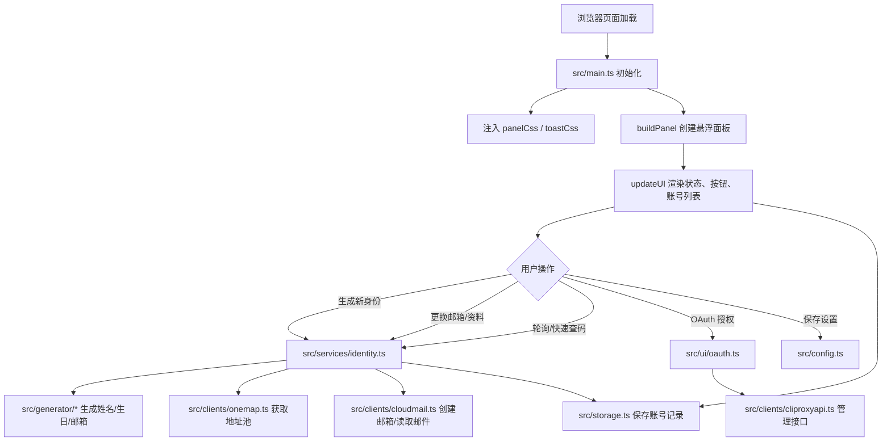
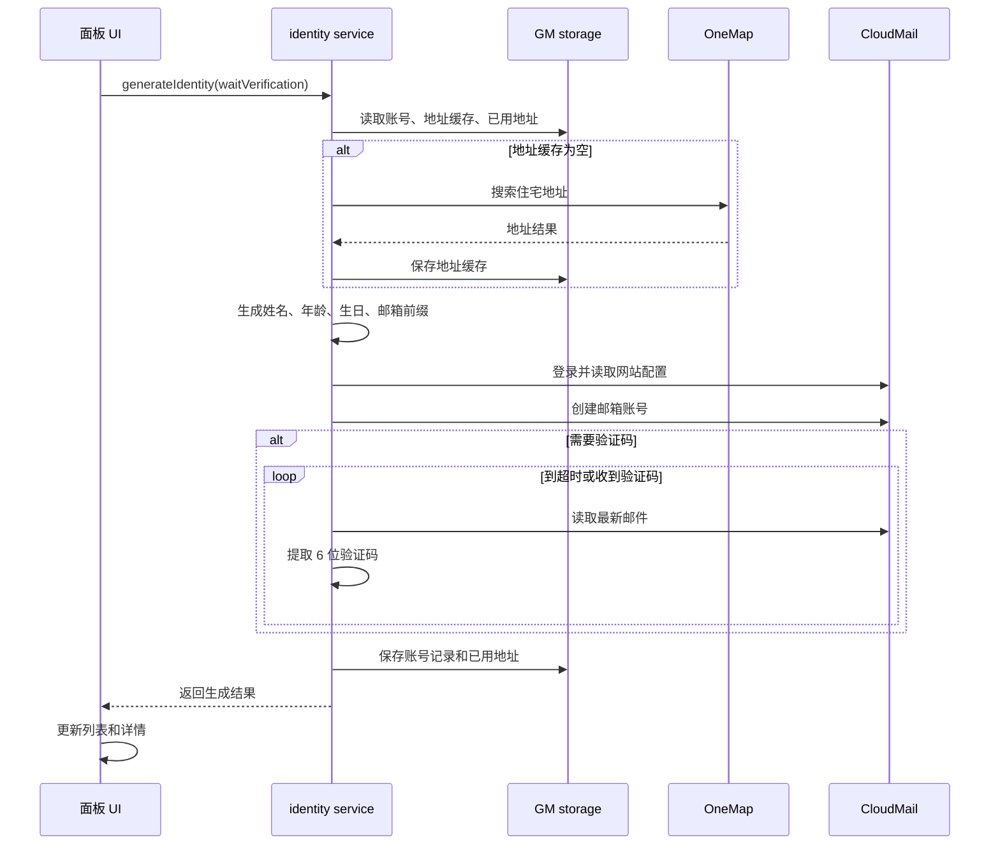
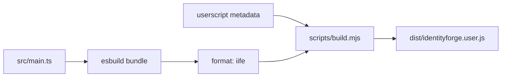

# IdentityForge

IdentityForge 是一个面向浏览器 Userscript 环境的身份资料辅助生成面板。它会在匹配的 OpenAI / ChatGPT 页面注入一个悬浮工具面板，用于生成新加坡风格的姓名、生日、地址、CloudMail 邮箱账号，并可轮询邮件验证码；同时集成 CLIProxyAPI 的 Codex OAuth 授权状态检查。

当前仓库采用 TypeScript 源码 + pnpm 构建流程，最终可安装脚本为 `dist/identityforge.user.js`。

## 快速开始

```bash
pnpm install
pnpm run typecheck
pnpm run build
```

安装脚本时，把 `dist/identityforge.user.js` 导入 Tampermonkey / Violentmonkey 等 Userscript 管理器。

## 配置项

面板右上角设置按钮可保存以下配置，数据存储在 Userscript 管理器提供的 `GM_setValue` 中：

| 配置 | 作用 | 默认值 |
| --- | --- | --- |
| `CLIPROXYAPI_BASE` | CLIProxyAPI 服务地址 | `https://api.example.com` |
| `CLIPROXYAPI_MANAGEMENT_KEY` | CLIProxyAPI 管理密钥 | 空 |
| `CLOUDMAIL_BASE` | CloudMail 服务地址 | `https://mail.example.com` |
| `CLOUDMAIL_LOGIN` | CloudMail 登录邮箱 | 空 |
| `CLOUDMAIL_PASSWORD` | CloudMail 登录密码 | 空 |
| `CLOUDMAIL_DOMAIN` | 新邮箱使用的域名 | `@example.com` |
| `CLOUDMAIL_POLL_INTERVAL` | 验证码轮询间隔，单位秒 | `5` |
| `CLOUDMAIL_POLL_TIMEOUT` | 验证码轮询超时，单位秒 | `600` |

## 项目结构

```text
.
├── dist/identityforge.user.js   # 构建产物，实际安装文件
├── scripts/build.mjs            # esbuild 打包脚本，注入 userscript metadata
├── src/
│   ├── main.ts                  # 注入样式、创建面板、初始化 UI
│   ├── config.ts                # GM 配置读写
│   ├── storage.ts               # 账号、地址池、已用地址持久化
│   ├── services/identity.ts     # 生成身份、更换资料、查验证码
│   ├── clients/                 # OneMap、CloudMail、CLIProxyAPI HTTP 客户端
│   ├── generator/               # 姓名、生日、邮箱、地址选择生成器
│   ├── ui/                      # 面板、OAuth、toast、样式、DOM helper
│   ├── utils/                   # 通用工具
│   └── verification.ts          # 邮件验证码提取与时间格式化
├── package.json
├── pnpm-lock.yaml
└── tsconfig.json
```

## 架构流程



## 身份生成流程



## 构建流程



## 开发约定

- 使用 pnpm，不提交 `package-lock.json` 或 `yarn.lock`。
- `src/` 是源码入口，`dist/identityforge.user.js` 是安装产物。
- 修改源码后运行 `pnpm run build`，确保产物同步更新。
- 提交前至少运行：

```bash
pnpm run typecheck
pnpm run build
node --check dist/identityforge.user.js
git diff --check
```

## 数据与安全边界

- 账号记录、配置、地址缓存都保存在 Userscript 管理器的本地 GM storage 中。
- 仓库不应提交真实 CloudMail 密码、CLIProxyAPI 管理密钥或任何 `.env` 文件。
- `dist/identityforge.user.js` 会包含默认占位域名和配置键名，但不应包含真实密钥。
